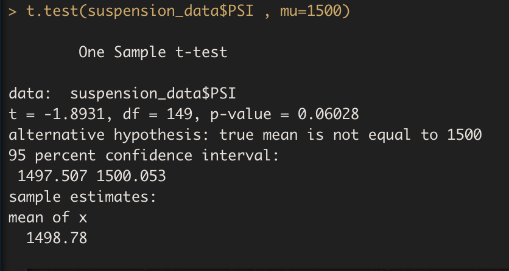

# MechaCar_Statistical_Analysis

## Linear Regression to Predict MPG
1. When looking through the data I performed a linear regression follwed by a summarization to figure out interestin key values in the data. There are two variables that provided a non-random amount of variance which were **vehicle_length** and **ground_clearance**.

2. We can assume that the slope is non zero due to our P-value from the linear regression analysis is much smaller than the significance level if 0.05%.
3. The linear model does predict mpg prototype effectively due to the r  squared value is .71 which corresponds with the accuracy.

## Summary Statistics on Suspension Coils

When looking at the base summary of all the lots together, the variance does not exceed the 100 pounds per square inch. On the other when looking at each lot individually there is an issue that arises.

When looking at the each individually, Lot3 has a significant variance of 170 which skews the distribution between the lots. Overall the manafacture data does meet the design specification but Lot3 should be overlooked and be adjusted accordingly.

## T-Tests on Suspension Coils

When looking at the overall t-test performance, our data is significantly less than the presumed population mean. The population mean is **1500** whilst our data is **1498.78**.

Let's look at each individual lot and see if any of the lots supports our hypothesis.

When looking at the t-test performance for lot 1, our data shows that there is no statistical difference between the observed sample mean and the presumed population mean.

When looking at the t-test performance for lot 2, our data shows that there is a statistical difference between the observed sample mean and the population mean. Lot 2 has a mean of **1500.2** which rejects the hypothesis.

When looking at the t-test performance for lot 3, our data shows that there is a statistical difference between the observed sample mean and the population mean. Lot 3 has a mean of **1496.14** while the population is **1500**.

## Study Design: MechaCar vs Competition

The MechaCar is an up and coming model that has very impressive metrices compares to the competition. The mecha car has amazing MPG compare to the competition and other metrics that would be tested is the cost of the car itself and the maintenance cost. our null hypothesis is that the most costly the car the more expensive the maintenance cost is. The alternative hypothesis that the cost of the car does not affect the cost of maintenance. One test that I believe would be useful to see the correlation between the two variables would be a simple linear regression because by using linear regression we can find if these two variables have any correlation which entails that if they are, it can be used to predict the cost of maintenance based on the cost of the car. The data we need is all of mecha car vehicles and the cost and maintenance cost for both to see the correlation between the two variables. Additionally, if you have data on the competition you can also find out the correaltion between the two variables using their data.